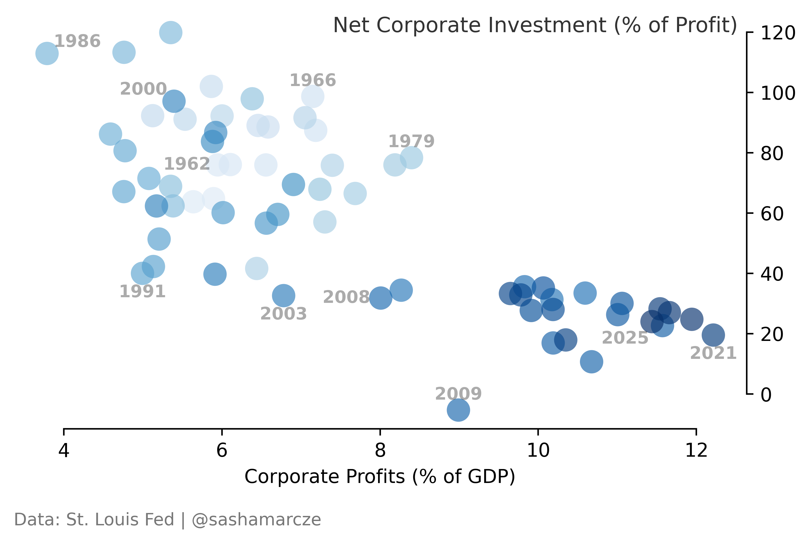

## The Term Structure of Capital

Neoliberalism in one simple chart (U.S. Corporates: 1960-2025). 

For a capitalist perspective in the acadmic literature see The Great Reversal (2019) by Thomas Philippon who refers to this as the "Investment Puzzle". 

## Data Sources

Based on data from the St. Louis Federal reserve (annualized units).

- **Corporate Profits (CP):** [https://fred.stlouisfed.org/series/CP](https://fred.stlouisfed.org/series/CP)

- **Net Corporate Investment (W790RC1Q027SBEA):** [https://fred.stlouisfed.org/series/W790RC1Q027SBEA](https://fred.stlouisfed.org/series/W790RC1Q027SBEA)

- **Gross Domestic Product (GDP):** [https://fred.stlouisfed.org/series/GDP](https://fred.stlouisfed.org/series/GDP)

## Prerequisites

To run the analysis, you will need a FRED API key. You can generate a free one here:

[https://fredaccount.stlouisfed.org/apikey](https://fredaccount.stlouisfed.org/apikey)

## Usage

1. Clone the repo: `git clone [your-repo-link]`
2. Add your api key to the script where indicated.
3. Install requirements: `pip install pandas matplotlib fredapi`
4. Run: `python profit_vs_investment.py`

## License
MIT
